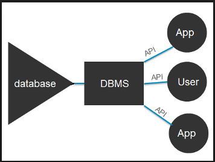
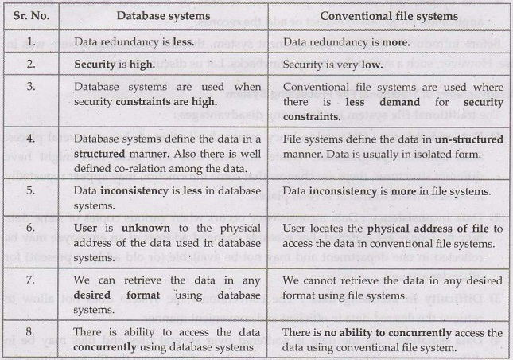

# Topic: Database Systems Fundamentals

## Data, Database and Database System🗃️
### Meaning
***Data:*** Raw facts.

***Database:*** An organized collection of structured data, stored electronically.

***DBMS (Database Management System):*** Software for accessing and managing a database.

***Database System:*** The combination of a database and a DBMS.

## Why database system are needed❔
For instance, old systems of college registration using paper forms and separate spreadsheets are inefficient and prone to errors. Database systems solve these problems.

## Problems with File-Processing (Old) Systems❌

* **Data Redundancy & Inconsistency:** Same data stored in multiple places, leading to conflicts.

* **Data Access Difficulty:** Hard to find specific information.
* **Data Isolation:** Data scattered across different files, hard to combine.
* **Integrity Issues:** Difficult to keep data accurate and reliable.
* **Atomicity Problems:** Trouble ensuring transactions are completed fully or not at all.
* **Concurrency Issues:** Problems arise when multiple users access data at the same time.
* **Security Risks:**  Hard to protect data.

## Advantages of Database Systems☑️
✓ Data Consistency: Ensures data accuracy throughout the database.

✓ Scalability & Flexibility: Handles large datasets and adapts to changes.

✓ Reduced Data Redundancy:  Minimizes duplication.

✓ Enhanced Security: Controls data access.

✓ Data Abstraction: Simplifies user interaction with data.

## Importance of Database Systems
Database systems are important because they help **store, organize, and manage data efficiently.** They are crucial in many areas like banking, social media, sales, and navigation.  "Data is the new gold.💰"

## History/Evolution 📜
1. File-Based (1950s-60s) – Simple files, hard to manage.
2. Hierarchical & Network (1960s-70s) – Structured like trees/networks, complex but faster.
3. Relational (1970s-Present) – Uses tables & SQL, making data management easy.
4. NoSQL (2000s-Present) – Handles big data, cloud, and flexible data.
5. Modern Databases (Now) – AI-powered, fast, and scalable.

## Difference between database and database management system.

## View of Data & Data Models📈
* DBMS supports database definition, creation, querying, updating, and administration.
* **Data Model:** Conceptual tools for describing data, relationships, semantics, and constraints.
* Types of Data Models:
  1. Entity-Relationship Model
  2. Semi-structured Data Model
  3. Object-Based Data Models
  4. Relational Model

## Early DBMS
- Hard to build and maintain.
- Tight logical-physical coupling.
- Queries had to be predefined.

## Edgar F. Codd & Relational Model
- Introduced in 1969.
- Separated logical and physical layers.
- Implemented in IBM’s System R in the late 1970s.
- **Relational Model:** Data stored in tables (relations), with rows (records) and columns (fields).
- Uses **SQL** for CRUD operations.

## Data Abstraction
* Hides complexity from users.
* Levels:
  * Physical: Data storage details.
  * Logical: Structure and relationships.
  * View: User-specific portions of data.

## Database Design
1. Select data model.
2. Develop conceptual design (functional requirements).
3. Develop logical design (schema mapping).
4. Develop physical design (storage and indexing).

## Database Instances & Schemas
* **Instance:** Current data in the database.
* **Schema:** Database blueprint (physical/logical).

## Database Languages
* **DDL:** Defines schema.
* **DML:** Queries and updates data.

## Database Engine
* Manages disk storage and CRUD operations.
* Some databases (MySQL, MariaDB) allow engine flexibility; others (Postgres) do not.

## Database Engine Components
1. **Storage Manager:** Manages low-level data.
2. **Query Processor:** Interprets and executes queries.
3. **Transaction Manager:** Handles concurrency and recovery.

## Database Access from Applications
* Uses APIs to send SQL queries.
* **ODBC** standard allows database access from C and other languages.

## Database Users & Administrators
### Database Users
1. End Users – Interact with databases via applications (e.g., online banking, e-commerce).
2. Application Programmers – Develop software that interacts with the database.
3. Database Designers – Define database structure and relationships.
4. System Analysts – Determine system requirements and database needs.
5. Sophisticated Users – Use query languages like SQL for complex queries.
### Database Administrators (DBA)
1. Manages Database System – Ensures performance, security, and availability.
2. Defines Access Policies – Grants/revokes user permissions.
3. Handles Backup & Recovery – Protects data against failures.
4. Monitors Performance – Optimizes queries and indexing.
5. Ensures Data Integrity – Maintains consistency and security.

## What I Learned & Why It Matters🤯
This unit taught me about **DBMS,** different **Data Models,** and how the **Relational Model** uses 
**tables** and **SQL** for managing data. **Data Abstraction** hleps simplify 
database use by separating **physical, logical, and view levels.** I also understood the steps in 
**Database Design,** from planning to implementation. Additionally, I learned about different 
**Database Users** and **Administrators (DBAs)** in ensuring **security, data integrity, and performance.** 
This knowledge is important for creating efficient databases and managing data effectively.

## Personal Growth and Reflection🚀
In this unit, I’ve learned how **databases** work and why choosing the right **data model** is important for managing data well. I now understand the basics of **relational databases, data abstraction,** and the role of **DBAs** in keeping databases secure and running smoothly. This unit also taught me how good **database design** affects how well a database performs and keeps data safe. Looking back, I feel more confident in understanding and handling databases, and I’m excited to use this knowledge in my future studies and projects.