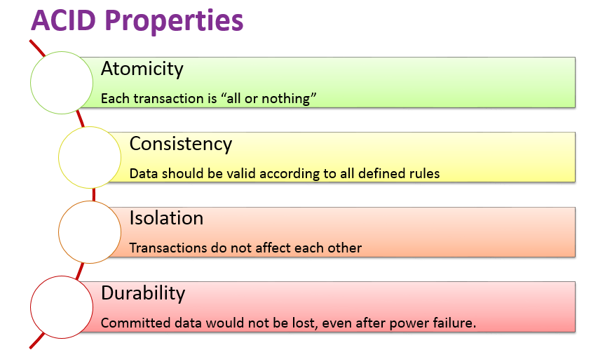

# Unit 3: Introduction to SQL 🗺️

## Introduction
Welcome to your friendly guide to understanding databases and SQL! This guide transforms lessons 6-8 into an engaging journey through the world of data management. Let's make databases exciting and approachable! 🚀

---

## Lesson 6: Database Fundamentals - The Foundation

### ACID Properties (The Four Guardians of Data)

Every database follows the **ACID** rules to ensure safe and reliable transactions. Let’s meet our guardians:


- **Atomicity**: The "All or Nothing" Hero  
  - Like ordering a combo meal - you either get everything or nothing!
  - *Why it matters*: Prevents incomplete transactions (imagine only getting half your paycheck 😱).

- **Consistency**: The "Rules are Rules" Champion  
  - Ensures data stays valid and follows defined rules.
  - *Why it matters*: Your bank balance always adds up correctly.

- **Isolation**: The "Personal Space" Defender  
  - Each transaction happens independently, avoiding conflicts.
  - *Why it matters*: Multiple users can work simultaneously without interference.

- **Durability**: The "Memory Keeper"  
  - Once a transaction is saved, it’s permanent, even if the system crashes.
  - *Why it matters*: Your data survives power outages and system failures.

### SQL Basics - Your New Best Friend 🛠️

SQL (Structured Query Language) helps us talk to databases. Here are its main components:


- **DDL (Data Definition Language)**: Defines the structure of your database.
  ```sql
  CREATE TABLE Users (
      ID INT PRIMARY KEY,
      Name VARCHAR(100),
      Email VARCHAR(100)
  );
  ```

- **DML (Data Manipulation Language)**: Works with existing data.
  ```sql
  INSERT INTO Users (ID, Name, Email)
  VALUES (1, 'Sonam', 'sonam@example.com');
  ```

- **Constraints**: Keep your data clean and reliable (e.g., NOT NULL, UNIQUE, PRIMARY KEY).

---

## Lesson 7: SQL Queries - The Art of Data Conversations 🎨


### SELECT Statements (The Data Explorer’s Toolkit)
```sql
SELECT * FROM Users;  -- Get everything
SELECT Name, Email FROM Users;  -- Get specific columns
```

### WHERE Clause (The Data Detective)
```sql
SELECT * FROM Users WHERE Age > 25;  -- Find users older than 25
```

### ORDER BY (The Organizer)
```sql
SELECT * FROM Users ORDER BY LastName ASC;  -- Sort alphabetically
```

---

## Lesson 8: Advanced SQL - Leveling Up! 🎮

### NULL Values (The Ghost in the Machine)
- NULL is **not** zero or empty—it means "unknown."
- Example:
  ```sql
  SELECT * FROM Users WHERE MiddleName IS NULL;
  ```

### Aggregate Functions (The Math Magicians)
- **COUNT()**: Counts rows
- **AVG()**: Finds average
- **MAX()/MIN()**: Finds highest and lowest values

Example:
```sql
SELECT COUNT(*) FROM Orders;
SELECT AVG(Salary) FROM Employees;
```

### GROUP BY & HAVING (The Party Planners)
```sql
SELECT Department, AVG(Salary)
FROM Employees
GROUP BY Department
HAVING AVG(Salary) > 50000;
```

---

## What I've Learned & Why It Matters 🎯

1. **Data Organization**: Well-structured data makes information retrieval efficient.
2. **Query Writing**: SQL is like learning a new language to talk to databases.
3. **Problem Solving**: Breaking down complex data questions into simple SQL queries.

---

## Personal Growth & Reflection 🌱

### The Journey
- Initially, databases felt intimidating.
- Now, I see them as powerful tools for organizing information.
- Learning to "think in data" has changed my approach to problem-solving.

### Key Realizations
1. SQL is not just for tech people—it's useful for anyone working with data.
2. Making mistakes is part of learning (DROP TABLE taught me to always have backups! 😅).
3. The joy of writing a query and getting exactly the data you need is unmatched!

### Future Applications
- Understanding how websites store user data.
- Making data-driven decisions.
- Exploring more advanced database concepts like joins and indexing.

---

## Fun Tips to Remember 🎈

- Think of databases as libraries, tables as books, and queries as library cards.
- NULL is just the database saying *"¯\\_(ツ)_/¯"*.
- Always backup before you DROP (I learned this the hard way!).
- SQL is like having a polite conversation with your data.

---

## Conclusion
Databases aren’t just storage—they're the backbone of modern applications. Learning SQL is like gaining a superpower in today’s data-driven world. Keep practicing, stay curious, and remember: *every expert started as a beginner!* 🚀
