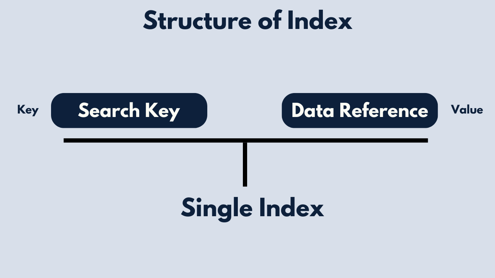
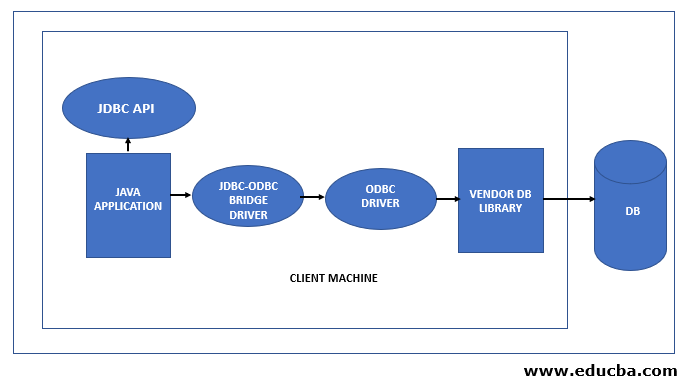
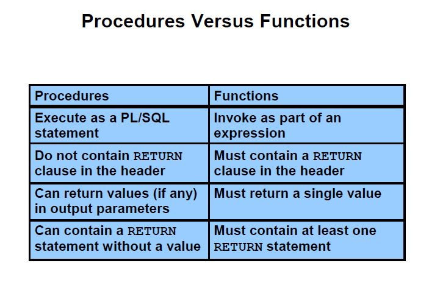
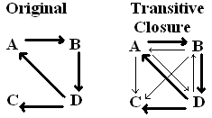

# Unit IV: Intermediate and Advanced SQL – Let’s Make Databases Smarter!

## Introduction
Welcome to **Unit IV** — the chapter where we level up from simply *talking* to databases, to making them *think* and *react*.

In the earlier units, we learned how to store and retrieve data. But now, it’s time to explore the *brains* behind the operation. Think of this unit as teaching your database kung fu — now it can defend itself, make decisions, and even yell when something changes. 💥

---

## 🔢 Lesson 9: Introduction to Number Systems

Before diving deep into the SQL matrix, we need to speak the language of machines: **Number Systems**.

### 🤔 What’s a Number System?
A number system is just a way to represent numbers using symbols. Humans love the decimal (base-10) system, but computers? They prefer simpler stuff — like **binary**.

| Number System | Base | Digits Used         |
|---------------|------|---------------------|
| Decimal       | 10   | 0–9                 |
| Binary        | 2    | 0, 1                |
| Octal         | 8    | 0–7                 |
| Hexadecimal   | 16   | 0–9, A–F            |

> 💡 **Fun Fact**: The word "bit" comes from "binary digit"! It's the smallest unit of data in a computer.

### ♻️ Decimal to Binary Conversion
To convert a decimal to binary:

1. Divide the number by 2.
2. Write down the remainder.
3. Repeat until you hit 0.
4. Read your remainders **backwards**.

**Example: Convert 13 to binary**
```
13 ÷ 2 = 6 R1  
6 ÷ 2 = 3 R0  
3 ÷ 2 = 1 R1  
1 ÷ 2 = 0 R1  
=> Binary: 1101
```

### ⬅️ Binary to Decimal Conversion
Each binary digit (bit) is multiplied by a power of 2, starting from the **right**.

**Example: Convert 1101 to decimal**
```
(1×2³) + (1×2²) + (0×2¹) + (1×2⁰)  
= 8 + 4 + 0 + 1 = 13
```

### ➕ Binary Arithmetic (Math Time!)
Binary math isn’t so scary — just different.

| Operation      | Result     |
|----------------|------------|
| 0 + 0          | 0          |
| 0 + 1          | 1          |
| 1 + 1          | 10 (carry 1) |
| 1 + 1 + 1      | 11 (carry 1) |

> 🚀 **Fun Fact**: Computers add in binary using circuits called "adders" built right into the CPU!

---

## 🚀 Lesson 10: Indexes, Authorization, and SQL Programming

### ⚡ Indexes — Making Data Zoom!
Imagine searching for a name in a huge list **without** an index — you’d scroll forever. That’s where indexes help.

They’re like bookmarks in a book: they don’t store the content, but they help you find things *fast*.



**Create a basic index:**
```sql
CREATE INDEX deptindex ON instructor (deptname);
```

**Create a unique index (no duplicates allowed):**
```sql
CREATE UNIQUE INDEX deptindex ON instructor (deptname);
```

**Delete an index:**
```sql
DROP INDEX index_name;
```

> 🔹 **Pro Tip**: Too many indexes can actually slow down writes! Use them wisely.

### 🔐 Authorization — SQL Security System
Not everyone should have keys to everything. SQL lets you **control access** with permissions (called *privileges*).

**Types of permissions:**
- `SELECT` – Read data
- `INSERT` – Add data
- `UPDATE` – Modify data
- `DELETE` – Remove data
- `EXECUTE` – Run stored programs

**Give access:**
```sql
GRANT SELECT, INSERT ON students TO user1;
```

**Take it back:**
```sql
REVOKE INSERT ON students FROM user1;
```

**Allow users to give access to others:**
```sql
GRANT SELECT ON department TO user1 WITH GRANT OPTION;
```

You can also **group permissions** into roles and use **views** (custom lenses into data) to keep things even tighter.

### 💻 SQL + Programming Languages
SQL isn’t lonely — it loves company from programming languages.



- **Dynamic SQL**: Build SQL statements *on the fly* (flexible, great for user-driven queries).
- **Embedded SQL**: Write SQL directly *inside* languages like C or Java.

**Common APIs:**
- JDBC (Java Database Connectivity)
- ODBC (Open Database Connectivity)

> 🎮 **Fun Fact**: The first embedded SQL standard was defined back in 1986!

---

## Lesson 11: Functions, Procedures, and Triggers — SQL Magic!

### 🧹 Functions — Reusable Query Blocks
A **function** in SQL returns a value or a table, based on inputs.

```sql
CREATE OR REPLACE FUNCTION get_patient_appointments(p_patient_id INT)
RETURNS TABLE (...) AS $$
BEGIN
  RETURN QUERY SELECT ... FROM Appointment WHERE PatientID = p_patient_id;
END;
$$ LANGUAGE plpgsql;
```

### 🛠 Procedures — Do Stuff Without Returning Data
**Procedures** are like mini-programs. They can validate, insert, update — and even throw errors if something’s off.

```sql
CREATE OR REPLACE PROCEDURE schedule_appointment(...) AS $$
BEGIN
  -- Check availability
  -- Generate ID
  -- Insert record
END;
$$;
```



### 🔀 Triggers — Automatic Reactions
A **trigger** is SQL’s way of saying “Hey! Something just happened!”

```sql
CREATE OR REPLACE FUNCTION notify_new_prescription() RETURNS TRIGGER AS $$
BEGIN
  RAISE NOTICE 'New prescription added: % for patient %', NEW.PrescriptionID, NEW.PatientID;
  RETURN NEW;
END;
$$ LANGUAGE plpgsql;
```

> ✨ **Fun Fact**: Triggers are widely used in banking systems to enforce real-time data integrity.

---

## 🔄 Lesson 12: Recursive Queries & Advanced SQL

### Recursive Queries — Climb the Data Tree!
Sometimes data connects to itself — like employees under managers, or parts in a product.

```sql
WITH RECURSIVE R AS (
  SELECT 1 AS n
  UNION ALL
  SELECT n + 1 FROM R WHERE n < 5
)
SELECT * FROM R;
```

### Transitive Closure — Connect the Dots
If A leads to B, and B leads to C… then A leads to C. That’s transitive closure. Recursive queries help **infer relationships**.



> 🔹 Must follow rules: no aggregates, NOT EXISTS, or EXCEPT in the recursive part.

---

## 💡 What I’ve Learned & Why It Matters

This unit transformed SQL from a query tool into a **full programming platform**. I learned:

- ✅ How computers understand numbers  
- ✅ How indexes speed up performance  
- ✅ How to protect data with permissions  
- ✅ How to automate tasks with procedures and triggers  
- ✅ How to write recursive queries for connected data  

This is how real-world systems scale — using SQL not just to *store* data, but to *think* with it.

---

## 🌱 Personal Growth & Reflection

Before this unit, SQL felt like asking the database to hand me stuff. Now, it feels like **training a teammate** to do work for me.

I feel more confident in:
- Writing clean, optimized queries
- Thinking like a backend engineer
- Debugging logic inside the database
- Automating real-world workflows

It’s not just about knowing SQL syntax anymore — it’s about thinking **strategically** in data.

---

## 😌Conclusion

Unit IV was a huge leap. From writing SELECTs to designing smart, secure, and responsive systems — this unit made me realize that databases aren’t just storage… they’re **powerhouses**.

They can **act**, **decide**, and **adapt** — and now, so can I. 💪

> 💼 **Fun Fact**: The original SQL language was called SEQUEL (Structured English QUEry Language). The name was later shortened to SQL!

#### Thank You 🙂‍↕️ 

