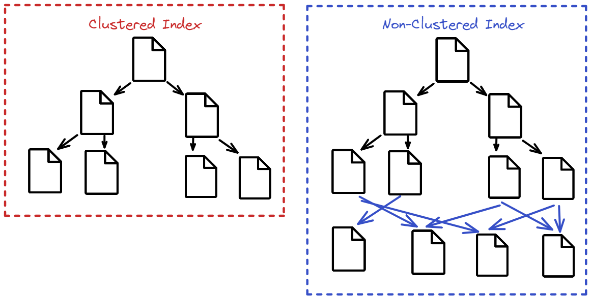

# Unit VI: Indexing and Query Processing
## Lesson 14: Indexing and Trees in SQL 🧭

## Introduction
Welcome back, data adventurers! 🌟 In this blog, we unravel the magic behind SQL indexing, multilevel strategies, and the mighty B-tree family. Whether you're querying data like a pro or still figuring out what a "hash index" is, this lesson will give you the boost you need. Let’s go from basics to brilliance! 🚀

---

### What Are Indexes? 📖

Indexes are like the table of contents in a book—they help the database find what it's looking for *fast*. Without them, the database would have to flip through *every* page to find a word.

- **Definition**: Special lookup tables that help speed up data retrieval.
- **Without Indexes?** Painful! Queries would read entire tables even for a single student record. 😓

---

### Types of Indices 🗂️

#### 1. Ordered Indices (Sorted & Ready!)
- **Clustering Index**: Records are stored in the same order as index entries.
- **Non-clustering Index**: Records are stored in a different order than index entries.

#### 2. Hashed Indices (Buckets of Speed!)
- **Hashing**: Spreads values across buckets using a hash function.
- **Search Key**: Attribute(s) used to look up data.

---

### Ordered Indices in Detail 🔍

#### Clustering Index:
- Entries match the sort order of the data.
- Pointers link to the **first** record of the matching key.

#### Non-Clustering Index:
- Entries may not match data order.
- Pointers link to **all** records matching the key.


---

#### Dense vs Sparse Index

**Dense Index**:
- Indexes every search key.
```sql
CREATE INDEX employees_idx ON employees (emp_id);
```

**Dense Non-Clustering Index**:
```sql
CREATE INDEX employees_dept_idx ON employees (department);
```

**Sparse Index**:
- Indexes *some* search keys.
```sql
CREATE INDEX employees_sparse_idx ON employees (salary) WITH (fillfactor=100);
```

🔍 Use `EXPLAIN ANALYZE` to see index performance:
```sql
EXPLAIN ANALYZE SELECT * FROM employees WHERE emp_id = 12345;
```

---

### Multilevel Indexing 🎯

#### Why Multilevel?
When indexes grow too large for memory, searching becomes slower. Enter **multilevel indexing**!

- **Inner Index** (on disk)
- **Outer Index** (smaller & in-memory)

🔁 Process:
1. Search outer index (fast)
2. Narrow down & search inner index (efficient)

---

### Secondary Indices 🔄

- Created on **non-primary key** columns.
- Helps in sorting/searching beyond the primary key.

👉 Example use case: Searching employees by **department** rather than **emp_id**.

---

### Meet the B-Tree Family 🌳

#### B+ Tree
- Self-balancing, ordered.
- Keeps data in **leaf nodes** only.
- Inner nodes only **guide** the search.

```sql
-- Example Search Process:
-- Start at root → move right if key > value → continue until leaf is reached.
```

#### B Tree
- General form of search tree (unlike BST, stores multiple keys per node).
- Nodes have:
  - Between ⌈n/2⌉ and n children.
  - Balanced height for optimized performance.

---

### Why B-Trees? 🔐

- Reduced height = faster access.
- More keys per node = fewer disk reads.
- Used heavily for databases and file systems.

#### Properties
- Ordered keys.
- Equal leaf depth.
- Root has ≥ 2 children.
- Balanced height via rules:
  - Left/right subtrees balanced.
  - Max height diff = 1.

---

### B-Tree vs. B+ Tree 🥊

| Feature        | B Tree       | B+ Tree      |
|----------------|--------------|--------------|
| Keys Stored In | All Nodes    | Leaf Nodes   |
| Internal Nodes | Keys + Data  | Only Keys    |
| Leaf Access    | Slower       | Faster       |

---

### Hash Indices 🧮

When equality searches matter (not range queries), hashing is king.

```sql
CREATE TABLE users (id SERIAL PRIMARY KEY, name TEXT);
CREATE INDEX ON users USING hash (id);

-- Insert
INSERT INTO users (name) VALUES ('Alice'), ('Bob');

-- Lookup
SELECT * FROM users WHERE id = 2;

-- Delete
DELETE FROM users WHERE id = 2;
```

#### Hash Buckets
- Data distributed using a hash function.
- Overflow handled via chaining.
- Not suitable for range queries.

---

### Static vs Dynamic Hashing 🧊🔥

- **Static**: Fixed buckets. Needs rebuild if overflow.
- **Dynamic**: Buckets grow incrementally (e.g., linear hashing).

```sql
REINDEX INDEX users_pkey;
```

---

## What I've Learned & Why It Matters 🧠

1. **Indexing is vital** for performance—think of it as memory for your database.
2. **Multilevel indexing** helps when data gets massive.
3. **B+ trees** are the unsung heroes behind efficient searches.

---

## Personal Growth & Reflection 🌱

- Initially, “index” felt like a textbook term. Now, I see it as a performance booster!
- Understanding **B+ trees** gave me confidence to approach real-world SQL problems.
- Learning to balance between **hashing and indexing** strategies helped me become a smarter data thinker.

---

## Fun Tips to Remember 🎉

- Dense = every record, Sparse = selective records.
- B+ Trees = like directories at malls — guide you to exact stores!
- Hashing is fast for exact matches, not for “find all under $500”.
- Always use `EXPLAIN ANALYZE` to validate performance.

---

## Conclusion

Indexing turns chaos into order in the database world. From clustering to hashing to B+ trees, these tools transform your SQL into something both powerful and elegant. Keep exploring, keep querying, and remember—your next `SELECT` might just fly thanks to a clever index! 🛫
