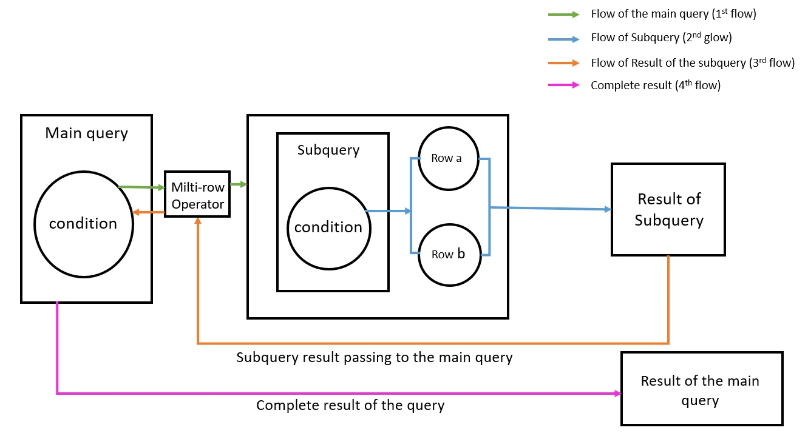

# Unit VI: Indexing and Query Processing
## Lesson 15: Subqueries & JOINs – Leveling Up SQL! 🔍🤝

### Introduction

Ready to explore the next level of SQL mastery? In Lesson 15, we dive into **subqueries** and **JOINs**—two powerful techniques to extract deeper insights from relational data. If you've ever wondered how to make your SQL queries smarter and more connected, this is your guide! Let's break it all down together. 💡

---

### Subqueries – The Query Inside a Query 🧠

A **subquery** is like a secret agent operating within your main SQL query. It helps filter, compare, or return data based on another layer of logic.

#### Where Can We Use Subqueries?

- Inside the `WHERE`, `HAVING`, or even `FROM` clause.
- Think of it as asking a follow-up question while answering the main one.

#### 🔸 Example:
```sql
SELECT name
FROM employee
WHERE dept_id = (
    SELECT dept_id
    FROM department
    WHERE dept_name = 'Sales'
);
```

🎯 **This returns**: All employees who work in the 'Sales' department.

#### Types of Subqueries:

1. **Single-row Subquery** 🧍  
   Returns just one row of data.

2. **Multiple-row Subquery** 👥  
   Returns multiple rows – used with `IN`, `ANY`, `ALL`.

   ```sql
   SELECT name
   FROM employee
   WHERE dept_id IN (
       SELECT dept_id
       FROM department
       WHERE location = 'KL'
   );
   ```

3. **Correlated Subquery** 🔁  
   Uses values from the outer query – runs row-by-row.

>💡 **Fun Fact:** Subqueries are like Russian nesting dolls 🪆—you open one, and there’s another query hiding inside!

---

### JOINs – Building Connections Between Tables 🤝

JOINs let you fetch data that spans multiple tables—perfect for when data is spread out across different parts of your database.

#### 🔹 INNER JOIN – The Classic Connection
Returns rows that have matching values in both tables.

```sql
SELECT employee.name, department.dept_name
FROM employee
INNER JOIN department
ON employee.dept_id = department.dept_id;
```

>💡 **Fun Fact:** INNER JOINs are like matchmaking apps for tables—only pairs with perfect matches get shown! 💑

#### 🔹 LEFT JOIN – The Loyal Friend
Returns all records from the **left** table, and matched ones from the right. If there's no match, NULL fills in the blanks.

```sql
SELECT employee.name, department.dept_name
FROM employee
LEFT JOIN department
ON employee.dept_id = department.dept_id;
```
>💡 **Fun Fact:** LEFT JOINs never leave their friends behind—if there's no match, they still show up with NULL as backup. 🧍‍♂️💬

#### 🔹 RIGHT JOIN – The Reverse Buddy
Just like LEFT JOIN, but starts from the **right** table instead.

#### 🔹 FULL OUTER JOIN – The Inclusive One
Returns all records when there is a match in **either** table.

#### 🔹 SELF JOIN – When You Know Yourself
Used to join a table to itself.

```sql
SELECT A.name AS Employee, B.name AS Manager
FROM employee A, employee B
WHERE A.manager_id = B.emp_id;
```

>💡 **Fun Fact:** SELF JOINs are like talking to yourself to get things sorted—surprisingly helpful in databases too! 🪞

---

### Subquery vs JOIN – When to Use What? ⚔️

| Subqueries | JOINs |
|------------|-------|
| Easier for filtering or conditional logic | Better for combining and displaying data |
| Can be slower for large data sets | Usually faster and more readable |
| Great when working in steps | Great for fetching related info |

>💡 **Fun Fact:** Subqueries filter. JOINs reveal. Together, they make your queries unstoppable! 💥

---

### What I’ve Learned 🎯

1. **Subqueries add power** to WHERE/HAVING clauses by filtering data dynamically.
2. **JOINs help connect data** across multiple tables smoothly.
3. Both techniques are **foundational** for writing flexible and complex queries.

---

### Personal Growth & Reflections 🌱

#### The Journey

* Initially, subqueries felt like puzzles within puzzles. 🧩  
* But once I understood their role, they felt empowering!  
* JOINs were confusing at first, especially LEFT vs RIGHT, but practice cleared that up.

#### Key Realizations

1. JOINs are game-changers for real-world data analysis.
2. Subqueries are great when I want to “ask a question within a question.”
3. Visualizing table relationships helps a lot!

#### Future Applications

* Building dashboards that pull from multiple tables.
* Creating reports that summarize user behavior or sales trends.
* Understanding complex SQL in job-related tasks.

---

### Fun Tips to Remember 🎈

- JOINs = Table friendships! 🤝  
- Think of subqueries as **mini detectives** helping your main query. 🕵️  
- Use aliases to keep things clean in JOINs (e.g., `employee A`, `employee B`).
- Practice JOINs using real examples like students & courses, employees & departments.

---

### Conclusion

Lesson 15 has unlocked a new level of SQL expertise! 🏆  
Understanding subqueries and JOINs is essential for mastering database systems. The more we play with them, the more confident we'll become. Let's keep experimenting, and let our queries tell the story of our data! 🚀
