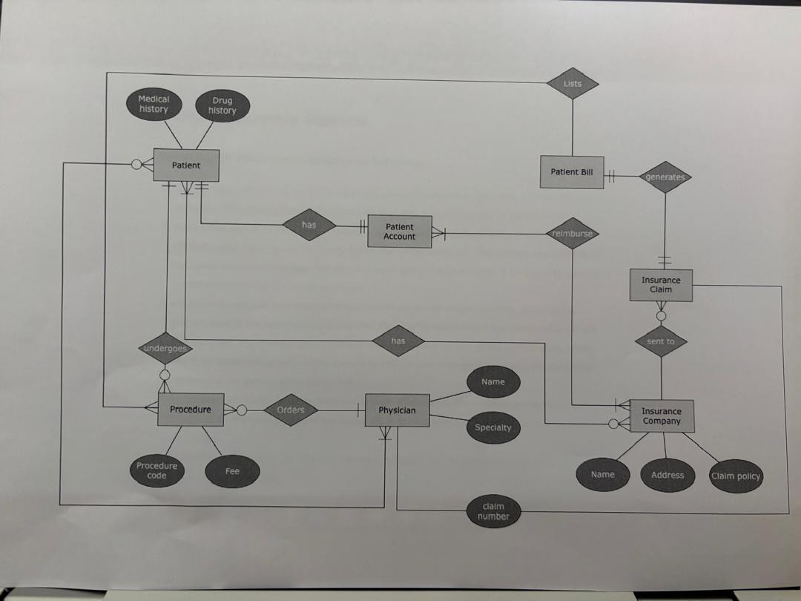
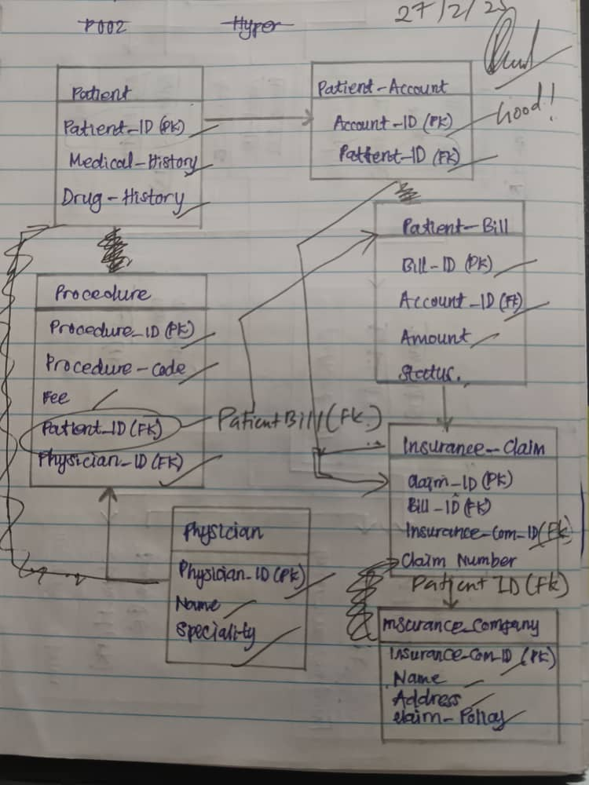
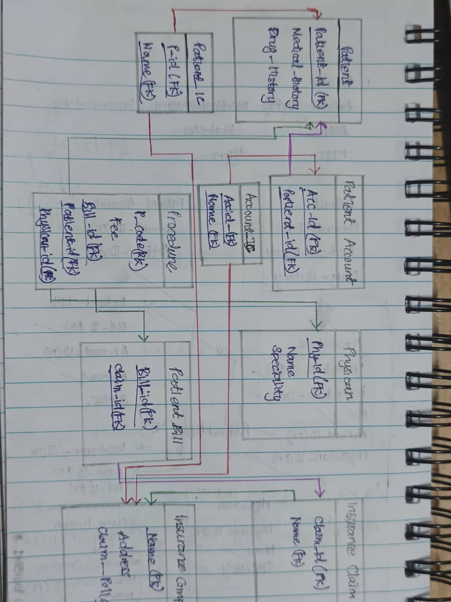

# Unit II - Database Design

## 🚀 Overview
Databases are the backbone of modern applications, storing and managing tons of information. This unit dives deep into the world of relational databases, helping us master the relational model, schema design, and relational algebra. Buckle up! 🎢

---
## 🏛️ Lesson 3: Entity-Relationship Model
### 🎯 Summary
This lesson introduces the **Entity-Relationship (ER) model**, a powerful tool for designing databases before they are built. Think of it as **blueprints for a house** 🏠—you wouldn't build without one, right?

### 🔑 Key Points
- **Entity** 🧍: A real-world thing, like a person, product, or spaceship 🛸.
- **Attributes** 🎨: Descriptive details of an entity, such as name, color, or mission type.
  - **Simple vs. Composite** (Single vs. Multi-part)
  - **Single-valued vs. Multi-valued** (One or Many)
  - **Derived** (Calculated from others)
- **Relationships** ❤️: How entities interact! (One-to-One, One-to-Many, Many-to-Many)
- **Primary Key 🔑**: Unique identifier for each entity.
- **Foreign Key 🛂**: Links one table to another.
- **Mapping Cardinalities 📊**: Determines how entities relate numerically.
- **Weak Entities 😢**: Need a stronger entity to exist.
- **Specialization & Generalization**: Entities can be grouped into broader or specific categories.
- **Aggregation**: Treating relationships as higher-level entities.

### 🤔 What I’ve Learned & Why It Matters
- ERDs help me **visualize data** before creating a database. No more “Oops, I forgot a table” moments! 😱
- Understanding relationships helps me **avoid data redundancy** and **improve efficiency**.
- Knowing **primary & foreign keys** ensures accurate **data retrieval** and prevents messy databases. 

### 🌱 Personal Growth & Reflection
Learning about ERDs has changed the way I think about organization. I now see how structured thinking helps in **both databases and real life**, like categorizing files on my computer or planning my weekly schedule. Maybe I should start designing my life like an ERD? 🤔😂

---
## 🏗️ Lesson 4: Relational Model and Schema Design
### 🎯 Summary
Tables, tables everywhere! 🏛️ This lesson introduces the **relational model**, which structures data using **relations (tables), attributes (columns), and tuples (rows).**

### 🔑 Key Points:
- **Relational Model 📊**: Think spreadsheets, but much cooler 😎.
- **Primary Keys 🏷️**: No duplicates allowed! Each row must be unique.
- **Foreign Keys 🔄**: Links data between tables to prevent chaos.
- **Schema Design 🏗️**: The process of defining tables and relationships for maximum efficiency.

### 🤔 What I’ve Learned & Why It Matters
- The relational model is **widely used in industry** (Google, Amazon, etc.).
- Good schema design prevents **data inconsistency & redundancy**.
- Knowing how to **structure data properly** makes querying & analysis easier.

### 🌱 Personal Growth & Reflection
After this lesson, I started noticing how relational databases impact my daily life—from my favorite apps to how online stores manage customer data. Understanding databases is like having a **superpower** in the digital world! 🦸🏻

---
## 🔄 Lesson 5: ERD to Relational Schema Translation
### 🎯 Summary
ERDs are cool, but they need to be **converted into real databases**! This lesson teaches how to translate **entities, attributes, and relationships into database tables.**

### 🔑 Key Points:
- **Entity Mapping 🔄** → Tables.
- **Attributes** → Columns.
- **Relationships 🔗** → Can become foreign keys or separate tables (junction tables for many-to-many relationships).
- **Normalization ⚖️**: Ensures data is structured correctly (no duplicate data!).

### 🤔 What I’ve Learned & Why It Matters
- Translating ERDs to schemas makes database creation **error-free & efficient**.
- Properly structured databases **run faster & store data effectively**.

### 🌱 Personal Growth & Reflection
At first, mapping ERDs to relational schemas felt overwhelming. But once I understood the logic, it felt like solving a puzzle 🧩—one that I actually enjoy! Now, I see how planning ahead makes everything smoother.

---
## 🧮 Lesson 6: Relational Algebra
### 🎯 Summary
Relational Algebra is the **mathematical language of databases**. Don’t worry—it’s **not as scary as it sounds**! 😅 It helps **query data using specific operations.**

### 🔑 Key Points:
- **Selection (σ) 🔍**: Filters rows.
- **Projection (π) 🎭**: Selects specific columns.
- **Union (∪) 🤝**: Combines tables.
- **Intersection (∩) 🏆**: Finds common data.
- **Difference (-) 🚫**: Finds unique data in one table but not another.
- **Join (⋈) 🔗**: Merges tables based on common attributes.

### 🤔 What I’ve Learned & Why It Matters
- **Understanding relational algebra = writing better SQL queries**.
- These operations **optimize database performance**.

### 🌱 Personal Growth & Reflection
I used to think databases were just about storing data, but now I see them as a **powerful tool for analysis**. Knowing relational algebra makes me feel like a **data wizard** 🧙‍♂️—one step closer to mastering SQL!

---
## 📖 Additional Resources
- 🔗 [Mapping from ER Model to Relational Model](https://www.geeksforgeeks.org/mapping-from-er-model-to-relational-model/)

---
## 📝 Exercises/ Classwork
- 🎨 Convert the ERD into relationl schema for given database.

- My work...😶

- Corrected version☺️

---
💡 **Final Thought:** Databases are like pizza 🍕—the better you structure them, the easier they are to enjoy. Keep practicing, and soon, I'll be the master chef of database design! 🎓

**Thank You**🫰🏻